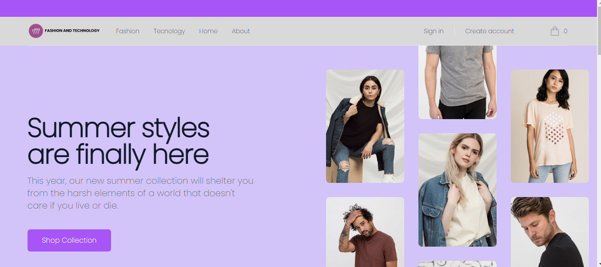

# Fashion & Tecnology:

**_Fashion & Tecnology_** es un Ecommerce moderno e intuitivo. Contiene una Interfaz de usuario responsive y personalizable. La Implementación de consultas y mutaciones es través de GraphQL. Gestión de base de datos relacional para consultas y relaciones complejas.

Las tecnologias utilizadas son las siguientes:

- Front-end (Client):
  - Typescript
  - React
  - Zustand
  - TailwindCSS
  - Apollo Client

- Back-End (Server):
  - Javascript
  - Express
  - Sequelize
  - GraphQL

- Base de datos
  - Supabase

 

  

